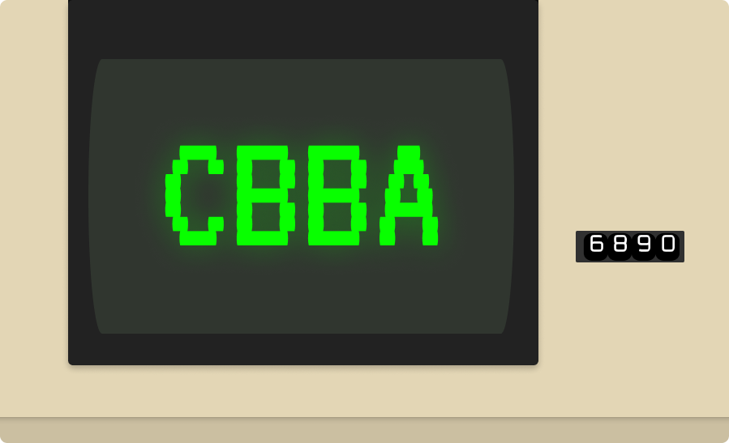
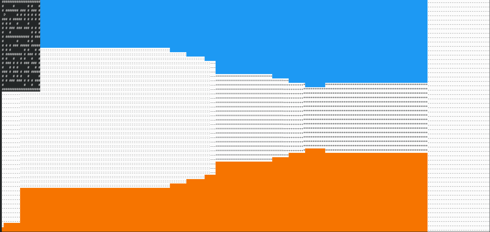

<details>
	<summary>Table of contents</summary>
	<ol>
		<li>
			<a href = "#about-the-project">About the project</a>
		</li>
		<li>
			<a href = "#Technologies-used">Technologies used</a>
		</li>
		<li>
			<a href = "#Getting-started">Getting started</a>
			<ul>
				<li>
					<a href = "#Released-project">Released project</a>
				</li>
				<li>
					<a href = "#Compiling-from-source">Compiling from source</a>
				</li>
			</ul>
		</li>
		<li>
			<a href="#License">License</a>
		</li>
		<li>
			<a href="#Contact-us">Contact us</a>
		</li>
		<li>
			<a href="#Acknowledgements">Acknowledgements</a>
		</li>
	</ol>
</details>


## About the project

This is the maze game of Team "CBBA-6890". We used a combination of raycasting and maze generation algorithms to make this game.

## Technologies used
We used two main technologies:
* C++
* ncurses

## Getting started
#### Released project
You can go to the Releases page of the project and download the latest version for your OS

#### Compiling from source

##### Prerequisites
+ If you are using a Windows machine it is recommended you have the ```make``` command and a compiler(Preferably ```g++```). The recommended compiler is [MinGW](https://sourceforge.net/projects/mingw)
+ If you are on Linux download ```ncurses.h```
	+ Arch and Arch-based distros
	```sh
	pacman -S ncurses
	```
	+ Debian and Debian-based
	```sh
	apt-get install libncurses5-dev libncursesw5-dev
	```

##### Compiling and running
1. Clone the project
```sh
git clone https://www.github.com/PSStefanov19/CBBA-6890
```
2. Choose the right makefile
	+ If you are using Windows
	```sh
	mingw32-make -f Windows
	```
	+ If you are using Linux
	```sh
	make -f Linux
	```
1. Run the project
	+ Windows
	```sh
	cd bin/
	main.exe
	```
	+ Linux
	```sh
	./bin/main.out
	```
## License
This project is licensed under the MIT license. See [License](License) for more information.

## Contact us
Presian Stefanov
+ Github - [@PSStefanov19](https://github.com/PSStefanov19)
+ Instagram - [@presian.cpp](https://www.instagram.com/presian.cpp/)
+ Email - PSStefanov19@codingburgas.bg
## Acknowledgements
Helpful resources I found while working on the project
+ [Choose an Open Source License](https://choosealicense.com/)
+ [Colsby Computer Science's makefile guide](https://www.cs.colby.edu/maxwell/courses/tutorials/maketutor/)
+ [TLDP's Ncurses HOWTO](https://tldp.org/HOWTO/NCURSES-Programming-HOWTO/)
+ [Invisible island's ncurses Windows port](https://invisible-island.net/ncurses/ncurses.html)
+ [One Lone Coder](https://github.com/OneLoneCoder)